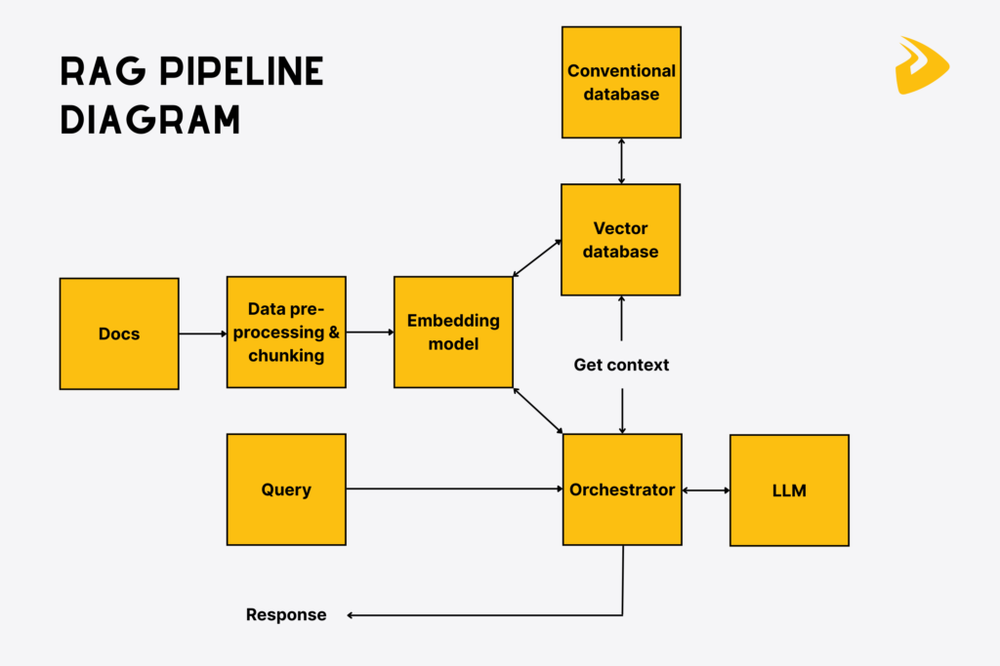

# Scalable Document Q&A with LangChain & RAG


-brightgreen)

**Elevator Pitch:** A foundational Retrieval-Augmented Generation (RAG) system designed to answer complex user questions by synthesizing information from an entire library of PDF documents.

---

## 1. The Problem & Opportunity

### The Business Problem
In many organizations, critical information is siloed across dozens or hundreds of unstructured documents like research papers, reports, and manuals. This leads to significant operational friction:
1.  **Inefficient Information Retrieval:** Employees waste hours manually searching through multiple PDFs to find specific answers.
2.  **Incomplete Answers:** Standard keyword search often fails to synthesize information from different sections or documents, leading to incomplete or out-of-context answers.
3.  **Scalability Challenge:** As the document library grows, manual search becomes completely untenable.

### The User Persona
*   **The Analyst / Researcher:** A professional who needs to ask complex questions and receive synthesized, accurate answers drawn from a large corpus of proprietary documents.

### The Hypothesis
We can dramatically improve the efficiency of enterprise knowledge retrieval by creating a RAG pipeline. This system will use an LLM to understand a user's natural language question, retrieve the most relevant context from all available documents, and generate a single, accurate, and consolidated answer.

---

## 2. The Solution: A Multi-Document RAG Pipeline

This project implements a classic and robust RAG architecture using the LangChain framework. It is designed to be a scalable foundation for any document-based Q&A application.

### The RAG Workflow
1.  **Load:** The system automatically ingests all PDF files from a specified folder (`PyPDFLoader`).
2.  **Split:** The documents are intelligently broken down into smaller, overlapping text chunks to ensure semantic integrity (`RecursiveCharacterTextSplitter` with `tiktoken`).
3.  **Embed & Store:** Each text chunk is converted into a numerical vector using OpenAI's embedding models and stored in a local, efficient ChromaDB vector store. This creates a searchable knowledge base.
4.  **Retrieve:** When a user asks a question, their query is embedded, and the vector store performs a similarity search to find the most relevant text chunks from the knowledge base.
5.  **Generate:** The retrieved chunks (the "context") are passed to a powerful LLM (GPT-3.5) along with the original question. A carefully crafted prompt ensures the model **answers the question based only on the provided context**, which grounds the response and prevents hallucination.

### Architecture

**Tech Stack:** Python, LangChain, OpenAI API, ChromaDB, PyPDF, Tiktoken
---

## 3. Key Results & Impact

The system was tested with a series of true/false and open-ended questions based on a corpus of famous academic papers about "big data" (GFS, MapReduce, Bigtable, Spark).

### Key Outcomes:
*   **Multi-Document Synthesis:** The system successfully answered questions that required information from multiple different PDFs, such as `"In Bigtable, every read and write of data under a single row key is atomic..."` (True).
*   **Hallucination Mitigation:** By strictly instructing the LLM to use only the retrieved context, the pipeline provided grounded answers and was able to correctly identify when an answer could not be found in the documents.
*   **Source Attribution:** The generated answers include the source document and page number, providing full auditability and increasing user trust in the system's output.

### Example Interaction:

**Question:**
> `"Bigtable maintains data in lexicographic order by row keys...Is this true or false"`

**Grounded Answer:**
> `"True. This statement is true based on the information provided... Bigtable maintains data in lexicographic order by row keys, and the row range for a table is dynamically partitioned into tablets, which are the units of distribution and load balancing (source: '/content/drive/My Drive/RAG/bigtable-osdi06.pdf', page 1)."`

---

## 4. Learnings & Future Roadmap

### Key Learnings
*   The classic "Load, Split, Embed, Retrieve, Generate" RAG pattern is a highly effective and scalable method for building powerful Q&A systems on custom documents.
*   The quality of the text splitting and the choice of embedding model are critical factors that directly influence retrieval accuracy and, therefore, the quality of the final answer.

### Future Roadmap
*   **V1.1 (Chat History):** Incorporate conversational memory to allow for follow-up questions, turning the Q&A system into a true "chat over documents" experience.
*   **V2.0 (Hybrid Search):** Augment the vector-based retriever with traditional keyword search (like BM25) to create a more robust hybrid search system that excels at both semantic and keyword-specific queries.
*   **V3.0 (User Interface):** Build a simple web frontend using a framework like Streamlit or Gradio to make the system accessible to non-technical users.

---

## 5. How to Use

### Prerequisites
Install the required Python libraries.
```bash
pip install -r requirements.txt